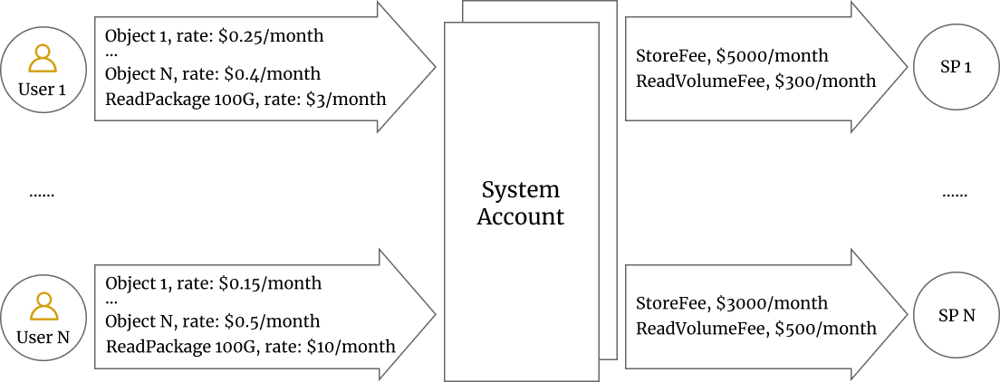

# 6. Storage Economics and Its Primitives

In this section, the underlying economics and the operating primitives
are discussed aligned with the lifecycle of a data object. The below
primitives can be executed after the genesis of the Greenfield
blockchain and enough SPs have registered themselves and started working
properly.

## 6.1 Account Creation

To write a data object into Greenfield, the users must have an account,
or more specifically, an address on the BNB Greenfield blockchain. This
can be done by transferring some BNB either from other addresses on
Greenfield or from BSC.

This may be a special route that users can skip this step but issue the
"transfer and write" request directly from BSC. As Greenfield and BSC
share the same address protocol, this action de facto creates an account
on Greenfield with the same address on BSC.

## 6.2 Data Object Creation

Users must create "Buckets" before creating objects. Similar to the
"Bucket" concepts in AWS S3, "buckets" here are a data resource to group
data objects from a user. All the objects under the same bucket will be
stored on the same primary SP and downloadable from that SP. Users can
create many buckets and store their data objects in different ones.

Each bucket has a Primary SP associated with it, which means all the
objects under this bucket will use that SP as the Primary SP. If the
chosen Primary SP cannot serve the requests well, the user may choose to
migrate the bucket to another SP completely via an on-chain transaction.

Data object creation is performed in two phases.

1. Request phase:

   a. Users first sign a "write" request with the initial object metadata, such as the object name, the bucket name,
   size,
   checksum, and the segment information and the redundancy setup as mandatory fields, while optionally content type and
   the
   storage preference, etc. It is worth noting that the checksum, the segment information, and the redundancy setup (
   based on
   Erasure Code, discussed in Part 3) will be calculated by the client software first. The client software will directly
   upload the segments together with the hashes as checksums. The data may or may not be encrypted at the users' choice.

   b. This request should be forwarded to the primary SP. After the primary SP determines to accept the request to store
   the data
   as the primary SP, it acknowledges the client by signing the same transaction message.

   c. After getting the SP's acknowledgment, users can submit the
   transaction to declare the creation of the objection on Greenfield.

   d. Greenfield accepts the "create" request and locks fees from users.

2. Seal phase:

   a. Users start connecting to the primary SP and uploading their data. Users have to sign some messages in the
   hand-shaking
   stage for authentication purposes.

   b. Once the data uploading has finished, the primary SP will sign the "uploaded" confirmation to the users.

   c. The primary SP syncs with secondary SPs to set up the data redundancy, and then it signs a "Seal" transaction with
   the
   finalized metadata for storage. If the primary SP determines that it doesn't want to store the file due to whatever
   reason,
   it can also "SealReject" the request. If the primary SP cannot receive the uploaded file in time, it can also send a
   "CancelCreation" request to cancel the client requests.

   d. Greenfield processes the "Seal" or "SealReject" transaction to begin the storage life cycle for the object.

There are scenarios in which the primary SP doesn't cooperate with the
user well: 1. The primary SP acknowledges the upload request, but
doesn't accept the upload in time; 2. the primary SP signs the
"uploaded" confirmation but doesn't seal the transaction in time.
Greenfield expects the primary SP to finish the object creation by
either "Seal", "SealReject", or "CancelRequest" transaction in a
predefined time window; otherwise, the primary SP will be punished with
a fine. Primary SP has no rational reasons to not acknowledge the upload
request or doesn't seal in time, while the users have no rational
reasons to create the requests but do not upload in time either.

There may be a special case in which the "create" is triggered from BSC
as a cross-chain transaction, the primary SP cannot get requests
directly. The primary SP can observe such requests and perform other
actions in the same way.

## 6.3 Data Storage

Once a data object is "Sealed", the owner of the object has de facto
entered a contract with the SPs for the storage, in which case the
owners should pay fees for such storage and the SPs should guarantee the
data availability.

The data object owners always have the right to change the primary SP to
store their data, after settling the outstanding fees.

The SPs, especially the primary SPs, can also inform people to stop
storing the data, due to either their own opinions or decision. Both
other SPs and the owners can observe corresponding notifications. Other
SPs can voluntarily propose themselves to be successors to store the
data objects on Greenfield if the owners do not react to the
notification in a predefined time, as other SPs do like to take the
business.

## 6.4 Data Read and Download

By design, the bytes that are stored and downloaded later for the object
are exactly the same bytes that were originally uploaded. SPs may use
their encryption logic as they wish, but when the data is being
downloaded, it shows the same bytes as it was uploaded. Users may choose
their own encryption scheme or use the default one provided by the
client software if they want the data to be unrecognizable by SPs or any
others, even though SPs have the obligation to not circulate these data
out of users' instruction.

Data objects can be only read and downloaded by the addresses with
proper read permissions. The Primary SP of the objects is the main
source to download from. If Primary SP is not available, the owner and
Greenfield blockchain validators can challenge (described in Part 3) and
change the object's primary SP to recover the downloading.

Each object has a time-based traffic bandwidth quota, which is provided
free, i.e. nobody needs to pay for downloading a certain amount within a
certain period. It is expected that this quota can satisfy most of the
individual download needs as part of the normal usage conditions.

For extra bandwidth to download the object, someone has to pay for the
data package, which is covered in the payment section.

## 6.5 Permissions and Group

Permission is the main logic introduced in Greenfield to enable
potential business models.

The data resources, including the objects, buckets, payment accounts,
and groups, all have permissions related. These permissions define
whether each account can perform particular actions.

Group is a list of accounts that can be treated in the same way as a
single account.

Examples of permissions are:

- Put, List, Get, Delete, Copy, and Execute data objects;

- Create, Delete, and List buckets

- Create, Delete, ListMembersOf, Leave groups

- Create, Associate payment accounts

- Grant, Revoke the above permissions

These permissions are associated with the data resources and
accounts/groups, and the group definitions are stored on the Greenfield
blockchain publicly. Now they are in plain text. Later a privacy mode
will be introduced based on Zero Knowledge Proof technology.

One thing that makes the permission operation more interesting is that
they can be operated from BSC directly, either through smart contracts
or by an EOA.

## 6.6 Fees and Payments

<i>Figure 6.1: Payment Stream Flow</i>

The storage fee will be charged on Greenfield in a steam payment style
like
*[Superfluid](https://docs.superfluid.finance/superfluid/protocol-overview/in-depth-overview/super-agreements/constant-flow-agreement-cfa)*
.

The fees are paid on Greenfield in the style of "Stream" from users to
receiver accounts at a constant rate. The fees are "charged" every
second as they are used.

There are two kinds of fees for Greenfield: object storage fee and data
package fee.

For storage, every object stored on Greenfield is charged at the price
calculated by size, replica numbers, a base price ratio, and other
parameters. Once the object is stored, the total charge of storage will
be mainly only related to time and the base price.

For data downloading, there is a free, time-based quota for each bucket
of users' objects. If it's exceeded, users can promote their data
package to get more quota. Every data package has a fixed price for the
defined period. Once the data package is picked, the total charge of
downloading will be only related to time and the data package price,
until the data package setting is changed again.

Here there is trust between the users and the SPs for data download. As
the extra downloading bandwidth will charge a fee and the download
journal is not fully stored on the Greenfield blockchain. SPs should
provide an endpoint interface for users to query the download billing
details with detailed logs and downloaders' signatures. If the users and
the SPs cannot agree on the bill, users may just select another Primary
SP.

By default, the object owner's address will be used to pay for the
objects it owns. But users can also create multiple "payment accounts"
and associate objects to different payment accounts to pay for storage
and bandwidth.

The address format of the payment account is the same as normal
accounts. It's derived by the hash of the user address and payment
account index. However, the payment accounts are actually only logical
ones and only exist in the storage payment module. Users can deposit
into, withdraw from and query the balance of payment accounts on the
Greenfield blockchain, but users cannot use payment accounts to perform
staking or other on-chain transactions. Payment accounts can be set as
"non-refundable". Users cannot withdraw funds from such payment
accounts.

Other users can also sponsor the payment by donating a "stream payment"
flow to selected "non-refundable" payment accounts. They can pause at
any time they want.

All the storage fees and data packages are priced and paid in BNB. There
are system parameters and price oracles from the Greenfield Relayers
(described below) to adjust the pricing based on the marketing
situation.

Once the payment accounts run out of BNB, the objects associated with
these payment accounts will suffer from a downgraded service of
downloading, i.e. the download speed and connection numbers will be
limited. Once the fund is transferred to the payment accounts, the
service quality can be resumed right away. If the service is not resumed
for a long time, it is the SPs' discretionary decision to clear the data
out, in a similar way to how SPs claim to stop services to certain
objects. In such a case, the data may be gone from Greenfield
completely.

## 6.7 Data Integrity and Availability Challenge

There are 3 aspects of data integrity, availability, and redundancy as
listed below:

1. The primary SP stores the correct object that the user uploaded.

2. The SP stores assigned data segments either as the role of primary
   SP or secondary SP correctly, and the data pieces stored should
   not be missing, corrupted, or counterfeit.

3. The Erasure Coding pieces stored in the secondary SPs can recover the original object stored in the primary SP.

The data integrity and redundancy should be first guarded by the
checksum and redundancy setup of the objects. They are part of the data
object metadata, which should be verified by the SPs and users when the
objects are created. This metadata will be stored on the Greenfield
blockchain as well.

Both Greenfield and SPs have to work together to ensure data integrity
and availability, especially for the above #2. Different from other
decentralized storage systems, here a "Proof-of-Challenge" is introduced
to build users' confidence that the data is stored well as promised.

Challengers can come from different stakeholders. Firstly, users can
submit challenge transactions; secondly, similar to users, SPs can
submit challenge transactions to other SPs; and lastly, Greenfield
blockchain will issue internal challenge events randomly as well.

The challenge can be triggered by Greenfield transactions or internal
events at the end of blocking. Once Greenfield validators observe such a
challenge, they should run a standard off-chain check against the data
from the SPs being challenged. These validators will vote for the
challenge results via an aggregated multisig via an off-chain P2P
network and submit them to the Greenfield blockchain. The failed result
for a challenge will slash the corresponding SPs. The submitter and
validators will get rewards for such challenges.

The data that failed the challenge will not be challenged within a
certain amount of time to give the SPs some time to recover.

Another section in Part 3 will cover the data availability challenges in
greater detail.

## 6.8 Data Delete

Users can request to delete their data objects. Greenfield will remove
the metadata from the blockchain state, while the primary SP should
respond to this request and drop all the replicas and redundant
segments. The payment stream will be closed with a reward rebate to
encourage the deletion.
