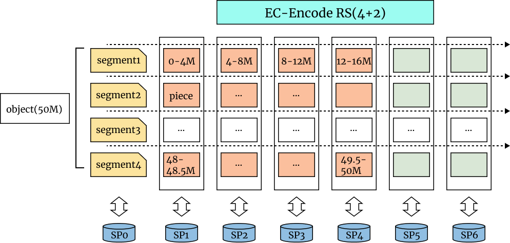

# 18 Payload Storage Management

Although the metadata will be stored on the Greenfield blockchain, the
content data to be stored on Greenfield is here called "payload" and
they are stored off-chain, on the Storage Providers.

The unit of such storage is "Object", and each object is split and
stored in an integral and redundant way to ensure the availability.

## 18.1 Segments

Segment is the basic storage structure of an object. An object payload
is composed of one or many segments in sequence. The default segment
size is 16MB. If the object's size is less than 16MB, it has only one
segment and the segment size is the same as the object's size. For
larger objects, the payload data will be broken into segments.

Please note the payload data of an object will be split into the same
size segment but the last segment, which is the actual size. For
example, if one object has a size 50MB, only the size of the last
segment is 2 MB and the other segments' sizes are all 16MB.

<div align="center"></div>
<div align="center"><i>Figure 18.1 Object Segmentation</i></div>

## 18.2 Erasure Code and Data Redundancy

### 18.2.1 Data Redundancy Design

Although each SP may provide a more stable service and won't go offline
as enough BNB are staking to be one SP, Greenfield still establish its
own redundancy strategy to get rid of the dependency on a single SP and
support the data availability in a decentralized way. Here below is the
basic design idea.

First, all segments of each object are stored in primary SP as "pieces",
which can be regarded as one replica of the object. Users may download
this data directly from the primary SP as it is supposed to provide the
full data in a low latency way.

Second, Erasure Code (EC) is introduced to get efficient data
redundancy. Segment is the boundary to perform erasure encoding. By
erasure encoding one segment at a time, it allows streaming the
processing of the object upload without waiting for the whole object
payload to finish. The default EC strategy is 4+2, 4 data chunks, and 2
parity chunks for one segment. The data chunk size is ¼ of the segment.
As one typical segment is 16M, one typical data chunk of EC is 4M.
Specialized customization on EC parameters for each user may be provided
via special transactions.

All EC chunks of each object are stored in some secondary SPs as pieces,
which can be regarded as more than one EC replica of the object. If one
or more segments of the object are lost from the primary SP, any 4
chunks from 6 SPs can recover the segments.

All these segments and SPs information are stored on the Greenfield
blockchain as the metadata of the object. The same object's each
segment's EC replicas are stored in the same sequence of secondary SPs.
This convention is to save the metadata size. An example of a 50M object
stored with one primary SP, SP0, and 6 secondary SPs, SP1-SP6 is shown
in the below diagram.

<div align="center"></div>
<div align="center"><i>Figure 18.2 EC for Segments in Different Secondary SPs</i></div>

### 18.2.2 Erasure Code

The EC module is defined as the following structure.

```go
type Erasure struct {
encoder func () Encoder

dataBlocks, parityBlocks int
chunkSize                int64
}
```

The *encoder* indicated the EC algorithm function type. The *dataBlocks*
and *parityBlock* are the main parameters of the EC algorithm. The
*chunkSize* indicated the size of each shard after encodes. Considering
the application scenario of Greenfield, the *dataBlocks* is set to 4;
*parityBlocks* is 2; and the *chunkSize* is configured to 16MB which is
corresponding to the piece size. Reed-Solomon is used as the EC
algorithm. The EC module has an Encode function to split data and encode
it into 6 blocks (4 data blocks and 2 parity blocks) and a Decode
function to reconstruct data from blocks.

The EC module has two additional functions：

1. Automatic padding. If the size of the last block is not divisible by 4,
   the EC encoding module will add some padding data into the
   segment which is no more than 3 bytes;

2. Parallel processing based on shard size for the optimal speed.

#### 18.2.2.1 Encoding

Here is a detailed EC encoding setup.

<div align="center"></div>
<div align="center"><i>Figure 18.3 EC Encoding</i></div>

As the example shown in the figure above, the 50M payload of the object
will be split into segments(16M each) and each segment will be encoded
by the Encode function of the EC module. All the segments can be
processed concurrently. Each segment is encoded into 4 data blocks
(indicated by an orange rectangle)and 2 parity blocks (indicated in the
green rectangle).

If the size of the last segment is less than 16MB, it will be encoded as
an independent part. But if it is smaller than 500k, it will be
considered to be merged with the previous segment.

If the size of the last block is not divisible by 4, it will be added by
1-3 bytes by the automatic padding function of the EC module. After all
the segments have been encoded, we have got 16 pieces which are 16M, and
6 pieces which are 0.5M.

Both the users' client software and the primary SP are responsible for
encoding the EC. Client software may not upload the EC parity but only
the checksum for the primary SP to verify.

From the primary SP to the secondary SPs, each EC chunk is treated as a
piece object and a data stream is maintained for each secondary SP for
parallel processing. Pieces will be stored in a data structure as "piece
store" on different SPs. As a reference implementation, the key of the
piece object is *objId_s+segIndex\_ spIndex+ ECIndex* for each segment.
The *spIndex* can indicate which secondary will be forwarded to. The
*ECIndex* is the index of EC chucks, with which 0-3 are data blocks and
4-5 are parity blocks. For example, the piece called obj0Id_s1_sp1 is
the 2nd segment of the object and will be forwarded to SP1.

#### 18.2.2.2 Decoding: Data Recovery

When the primary SP loses some segment, it or other SPs can recover the
data via the EC chunks. As designed, the ECIndex with values 0-3 are
data blocks while 4-5 are parity blocks. There are two processing cases
to reconstruct the object payload:

1. All data blocks are fully stored in secondary SPs. The recovery
   initiator can just read the pieces which are data blocks
   sequentially and stitch them together;

2. Some data blocks have been lost by secondary SPs. The recovery
   initiator needs to read all the data blocks and parity blocks and
   use the Decode function of the EC module to recover the content of
   all the segments.
